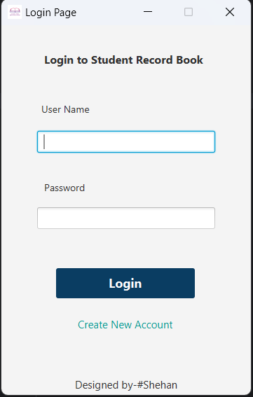
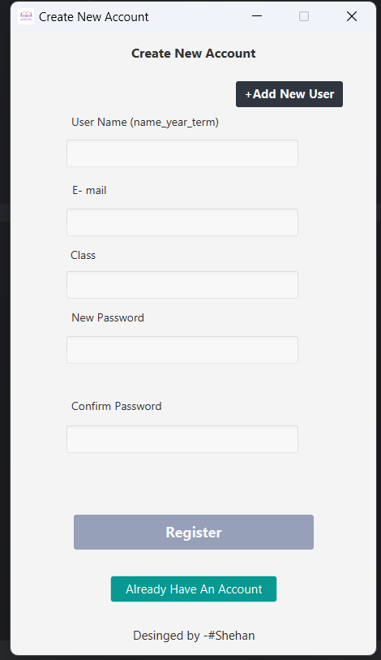
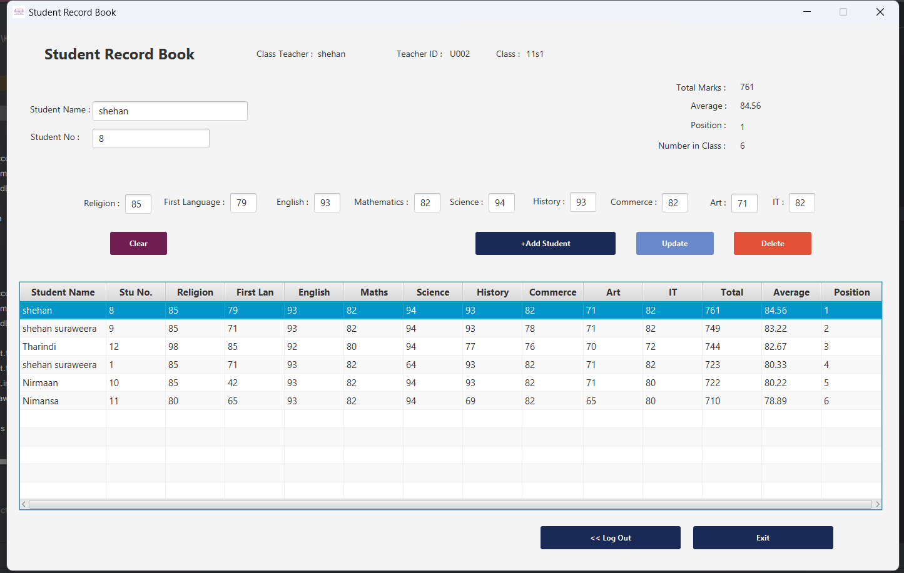

# Student Mark Book Application

A desktop application for managing student marks and grades, developed using **Java**, **JavaFX**, and **MySQL**. The application allows teachers to efficiently manage student records, calculate total marks, average scores, and class positions, and maintain persistent data in a MySQL database.

## Features

- **Add Student**: Enter student details, including scores for different subjects.
- **Update & Delete**: Modify or remove student records.
- **Automatic Calculations**: Calculates total marks, average, and class position based on scores.
- **User-Friendly Interface**: A clean and intuitive interface built with JavaFX.
- **Database Integration**: Data is stored in a MySQL database for persistence.

## Technologies Used

- **Java**: Core programming language.
- **JavaFX**: For building the user interface.
- **MySQL**: Database to store and retrieve student records.
- **MVC Architecture**: Follows Model-View-Controller pattern for a modular code structure.

## Screenshots

### Application Login Window

### Application Register Window

### Application Main Window

